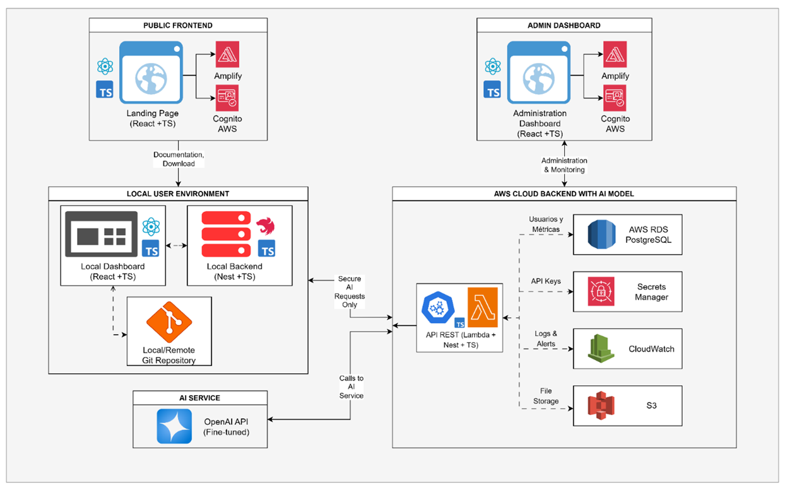

# 🎯 Omega Testing Dashboard MVP - Interfaz de Usuario Local

## Repositorio Backend - Trabajo de titulación

## Autor: Bryan Enrique Garay Benavidez

## 📋 Descripción del Proyecto

Este es el **dashboard de usuario local** del sistema completo de testing automatizado. Su propósito es proporcionar una interfaz web moderna e intuitiva para gestionar proyectos de testing Playwright + BDD generados por el motor de generación.

## 🏗️ Arquitectura del MVP

Este dashboard es parte del **Local User Environment** en la arquitectura completa del sistema:



### Componentes del Dashboard

- **Dashboard Principal**
  - *Tecnologías*: React 18 + TypeScript + Vite
  - *Descripción*: Vista general del estado de proyectos, métricas y ejecuciones recientes

- **Gestión de Proyectos**
  - *Tecnologías*: React Router + TailwindCSS + Radix UI
  - *Descripción*: Interfaz para crear, editar y administrar proyectos de testing generados

- **Centro de Ejecución**
  - *Tecnologías*: WebSockets + Framer Motion
  - *Descripción*: Monitoreo en tiempo real de ejecuciones de pruebas con logs y métricas

- **Configuraciones Locales**
  - *Tecnologías*: Context API + LocalStorage
  - *Descripción*: Gestión de preferencias, temas y configuraciones específicas del usuario

## 🎯 Propósito de este MVP

Este dashboard es la **interfaz de usuario local** del sistema completo. Se enfoca en proporcionar una experiencia web moderna para:

- **Gestionar proyectos** de testing generados por el motor
- **Monitorear ejecuciones** en tiempo real
- **Configurar preferencias** locales del usuario
- **Visualizar métricas** y reportes de testing

**¿Por qué interfaz web local?**
- Proporciona una experiencia moderna sin necesidad de aplicaciones nativas
- Se ejecuta en el navegador del usuario manteniendo privacidad total
- Se comunica con el motor de generación local vía API REST
- Permite acceso desde cualquier dispositivo en la red local

## 🛠️ Stack Tecnológico

### Frontend Principal
- **React 18** - Biblioteca de interfaz de usuario
- **TypeScript 5** - Tipado estático para mayor robustez
- **Vite** - Build tool rápido para desarrollo y producción
- **React Router 6** - Enrutamiento SPA con lazy loading

### UI/UX
- **TailwindCSS** - Framework CSS utility-first para diseño rápido
- **Radix UI** - Componentes accesibles sin estilos predefinidos
- **Lucide React** - Iconografía moderna y consistente
- **Framer Motion** - Animaciones fluidas y transiciones

### Estado y Datos
- **Context API** - Gestión de estado global
- **React Query** - Gestión de estado del servidor y caché
- **Zod** - Validación de esquemas en tiempo de ejecución

### Desarrollo
- **SWC** - Compilador rápido para TypeScript/JavaScript
- **Vitest** - Framework de testing moderno
- **Prettier** - Formateo automático de código
- **ESLint** - Linting y análisis estático

## 📋 Requisitos

- **Node.js** (versión 18 o superior)
- **npm** (incluido con Node.js)
- **Motor de Generación** ejecutándose en `http://localhost:3000`

## 🚀 Instalación y Ejecución

### Método 1: Instalación Directa (⭐ RECOMENDADO)

#### 1. Clonar el Repositorio
```bash
git clone https://github.com/BryanGaray99/omega-testing-dashboard-mvp.git
cd omega-testing-dashboard-mvp
```

#### 2. Configurar Variables de Entorno
```bash
# Copiar el archivo de ejemplo
cp .env.example .env

# Editar las variables según tu configuración
# Especialmente importante:
# - VITE_API_URL: URL del motor de generación (default: http://localhost:3000)
# - VITE_APP_PORT: Puerto del dashboard (default: 5173)
```

#### 3. Instalar Dependencias
```bash
npm install
```

#### 4. Ejecutar el Dashboard
```bash
npm run dev
```

#### 5. Verificar que Funciona
- **Dashboard**: http://localhost:5173
- **Motor de Generación**: http://localhost:3000 (debe estar ejecutándose)

### ⚠️ Configuración del Archivo .env

Asegúrate de que tu archivo `.env` contenga las siguientes variables:

```env
# URL del motor de generación (backend)
VITE_API_URL=http://localhost:3000

# Puerto del dashboard
VITE_APP_PORT=5173

# Modo de desarrollo
VITE_DEV_MODE=true

# Configuración de autenticación (futuro)
VITE_AUTH_ENABLED=false

# Configuración de temas
VITE_DEFAULT_THEME=system
```

### Método 2: Con Docker (Solo para desarrollo/pruebas)

```bash
docker build -t omega-dashboard .
docker run -p 5173:5173 omega-dashboard
```

## 🎯 ¿Qué hace este Dashboard?

1. **Gestiona proyectos** de testing generados por el motor
2. **Monitorea ejecuciones** en tiempo real con logs y métricas
3. **Configura preferencias** locales del usuario
4. **Visualiza reportes** y analytics de testing
5. **Proporciona interfaz** moderna para todas las operaciones
6. **Mantiene privacidad** total ejecutándose localmente

## 📊 Status Actual del MVP

### ✅ **Completado**
- ✅ Interfaz web moderna con React 18 + TypeScript
- ✅ Sistema de navegación con React Router
- ✅ Componentes UI accesibles con Radix UI
- ✅ Temas claro/oscuro con persistencia
- ✅ Sidebar colapsable responsive
- ✅ Dashboard principal con métricas
- ✅ Páginas de configuración completas
- ✅ Sistema de autenticación básico
- ✅ Integración con motor de generación
- ✅ Build optimizado con Vite

### 🔄 **En Desarrollo**
- 🔄 Gestión completa de proyectos
- 🔄 Monitoreo en tiempo real de ejecuciones
- 🔄 Reportes y analytics avanzados
- 🔄 Integración con WebSockets

### 📋 **Próximos Pasos**
- 📋 Sistema de notificaciones
- 📋 Exportación de reportes
- 📋 Integración con IA (fase posterior)
- 📋 Colaboración en equipo

## 📚 Funcionalidades Disponibles

### Dashboard Principal
- **Vista General**: Métricas de proyectos y ejecuciones
- **Proyectos Recientes**: Acceso rápido a proyectos activos
- **Ejecuciones Activas**: Monitoreo en tiempo real
- **Métricas Clave**: Estadísticas de testing

### Gestión de Proyectos
- **Crear Proyecto**: Interfaz para nuevos proyectos
- **Listar Proyectos**: Vista de todos los proyectos
- **Editar Proyecto**: Modificar configuraciones
- **Eliminar Proyecto**: Gestión del ciclo de vida

### Centro de Ejecución
- **Ejecutar Tests**: Lanzar pruebas desde la interfaz
- **Monitoreo en Tiempo Real**: Logs y progreso
- **Resultados**: Visualización de reportes
- **Historial**: Ejecuciones anteriores

### Configuraciones
- **Perfil de Usuario**: Información personal
- **Seguridad**: Configuración de autenticación
- **Apariencia**: Temas y personalización
- **Notificaciones**: Preferencias de alertas
- **Exportación**: Configuración de reportes

## 🧪 Probar el Dashboard

### Acceso Inicial
1. **Abrir navegador**: http://localhost:5173
2. **Modo invitado**: Funciones básicas sin login
3. **Login opcional**: Para funciones avanzadas

### Crear un Proyecto
1. **Navegar a Projects**
2. **Hacer clic en "Nuevo Proyecto"**
3. **Completar formulario**:
   - Nombre: `mi-proyecto-test`
   - URL Base: `http://localhost:3004`
   - Descripción: `Proyecto de prueba`

### Ejecutar Tests
1. **Seleccionar proyecto**
2. **Ir a Execution Center**
3. **Hacer clic en "Ejecutar Tests"**
4. **Monitorear progreso** en tiempo real

## 🛠️ Scripts Disponibles

```bash
npm run dev          # Desarrollo (hot reload)
npm run build        # Construir para producción
npm run build:client # Construir solo cliente
npm run build:server # Construir solo servidor
npm run start        # Ejecutar en producción
npm run test         # Ejecutar tests
npm run typecheck    # Verificar tipos TypeScript
npm run format.fix   # Formatear código
```

## 🛠️ Solución de Problemas

### Puerto ocupado
El dashboard automáticamente prueba puertos 5173, 5174 y 5175. Si todos están ocupados:
```bash
VITE_APP_PORT=5176 npm run dev
```

### Problemas de dependencias
```bash
npm cache clean --force
rm -rf node_modules package-lock.json
npm install
```

### Motor de generación no disponible
Asegúrate de que el motor de generación esté ejecutándose:
```bash
# En otra terminal, desde el directorio del backend
cd ../central-backend-mvp
npm run start:dev
```

### Configuración de API
Si el motor de generación está en un puerto diferente:
```bash
# En .env
VITE_API_URL=http://localhost:3001
```

## 📁 Estructura

```
client/
├── components/         # Componentes React
│   ├── ui/            # Componentes UI base (Radix)
│   ├── Layout.tsx     # Layout principal
│   └── ...
├── contexts/          # Context providers
├── pages/             # Páginas de la aplicación
│   ├── settings/      # Páginas de configuración
│   └── ...
├── hooks/             # Custom hooks
├── lib/               # Utilidades y helpers
└── App.tsx            # Componente raíz
server/                # Backend Express (servidor estático)
shared/                # Código compartido
public/                # Archivos estáticos
```

## 📝 Notas Importantes

- **Ejecución Local**: Este dashboard está diseñado para ejecutarse localmente
- **Dependencia del Motor**: Requiere que el motor de generación esté ejecutándose
- **Privacidad Total**: Todos los datos permanecen en la máquina local
- **Configuración**: Funciona sin archivo `.env` usando valores por defecto
- **Temas**: Soporte completo para tema claro/oscuro con persistencia
- **Responsive**: Optimizado para desktop y móvil

## 🔮 Arquitectura Futura

Este dashboard es parte del **Local User Environment** en el sistema completo:

1. **Motor de Generación** (Backend MVP) - Genera proyectos
2. **Dashboard Local** (Este MVP) - Interfaz de usuario
3. **Backend con IA** (fase posterior) - Servicios en la nube
4. **Public Frontend** (fase posterior) - Landing page pública
5. **Admin Dashboard** (fase posterior) - Panel de administración

## 🚧 Roadmap

### Fase 1: Fundamentos ✅
- [x] Interfaz de usuario base
- [x] Sistema de navegación
- [x] Temas y configuración
- [x] Integración con motor

### Fase 2: Core Features (En Desarrollo)
- [ ] Gestión completa de proyectos
- [ ] Monitoreo en tiempo real
- [ ] Reportes y analytics
- [ ] Sistema de notificaciones

### Fase 3: Funciones Avanzadas (Futuro)
- [ ] Integración con IA
- [ ] Colaboración en equipo
- [ ] Exportación avanzada
- [ ] Integraciones externas

---

**¡Listo! El dashboard estará ejecutándose en http://localhost:5173**
