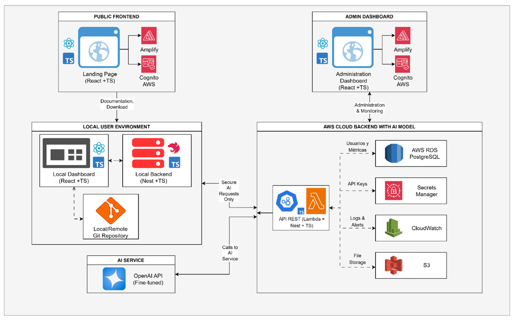

# 🎯 Omega Testing Dashboard MVP - Local User Interface

## Backend Repository - Thesis Project

## Author: Bryan Enrique Garay Benavidez

## 📋 Project Description

This is the **local user dashboard** of the complete automated testing system. Its purpose is to provide a modern, intuitive web interface for managing Playwright + BDD testing projects generated by the generation engine.

## 🏗️ MVP Architecture

This dashboard is part of the **Local User Environment** in the full system architecture:



### Dashboard Components

- **Main Dashboard**
  - *Technologies*: React 18 + TypeScript + Vite
  - *Description*: Overview of project status, metrics, and recent runs

- **Project Management**
  - *Technologies*: React Router + TailwindCSS + Radix UI
  - *Description*: Interface to create, edit, and manage generated testing projects

- **Execution Center**
  - *Technologies*: WebSockets + Framer Motion
  - *Description*: Real-time monitoring of test runs with logs and metrics

- **Local Settings**
  - *Technologies*: Context API + LocalStorage
  - *Description*: Management of preferences, themes, and user-specific settings

## 🎯 Purpose of this MVP

This dashboard is the **local user interface** of the complete system. It focuses on providing a modern web experience for:

- **Managing projects** generated by the engine
- **Monitoring runs** in real time
- **Configuring** local user preferences
- **Viewing** testing metrics and reports

**Why a local web interface?**
- Provides a modern experience without native apps
- Runs in the user's browser with full privacy
- Communicates with the local generation engine via REST API
- Allows access from any device on the local network

## 🛠️ Tech Stack

### Main Frontend
- **React 18** - UI library
- **TypeScript 5** - Static typing for robustness
- **Vite** - Fast build tool for development and production
- **React Router 6** - SPA routing with lazy loading

### UI/UX
- **TailwindCSS** - Utility-first CSS framework for fast design
- **Radix UI** - Accessible components without predefined styles
- **Lucide React** - Modern, consistent iconography
- **Framer Motion** - Smooth animations and transitions

### State and Data
- **Context API** - Global state management
- **React Query** - Server state and cache management
- **Zod** - Runtime schema validation

### Development
- **SWC** - Fast compiler for TypeScript/JavaScript
- **Vitest** - Modern testing framework
- **Prettier** - Automatic code formatting
- **ESLint** - Linting and static analysis

## 📋 Requirements

- **Node.js** (version 18 or higher)
- **npm** (included with Node.js)
- **Generation Engine** running at `http://localhost:3000`

## 🚀 Installation and Running

### Method 1: Direct Installation (⭐ RECOMMENDED)

#### 1. Clone the Repository
```bash
git clone https://github.com/BryanGaray99/omega-testing-dashboard-mvp.git
cd omega-testing-dashboard-mvp
```

#### 2. Configure Environment Variables
```bash
# Copy the example file
cp .env.example .env

# Edit variables according to your setup
# Especially important:
# - VITE_API_URL: Generation engine URL (default: http://localhost:3000)
# - VITE_APP_PORT: Dashboard port (default: 5173)
```

#### 3. Install Dependencies
```bash
npm install
```

#### 4. Run the Dashboard
```bash
npm run dev
```

#### 5. Verify It Works
- **Dashboard**: http://localhost:5173
- **Generation Engine**: http://localhost:3000 (must be running)

### ⚠️ .env File Configuration

Make sure your `.env` file contains the following variables:

```env
# Generation engine URL (backend)
VITE_API_URL=http://localhost:3000

# Dashboard port
VITE_APP_PORT=5173

# Development mode
VITE_DEV_MODE=true

# Authentication configuration (future)
VITE_AUTH_ENABLED=false

# Theme configuration
VITE_DEFAULT_THEME=system
```

### Method 2: With Docker (Development/testing only)

```bash
docker build -t omega-dashboard .
docker run -p 5173:5173 omega-dashboard
```

## 🎯 What Does This Dashboard Do?

1. **Manages projects** generated by the engine
2. **Monitors runs** in real time with logs and metrics
3. **Configures** local user preferences
4. **Displays reports** and testing analytics
5. **Provides** a modern interface for all operations
6. **Keeps full privacy** by running locally

## 📊 Current MVP Status

### ✅ **Completed**
- ✅ Modern web interface with React 18 + TypeScript
- ✅ Navigation system with React Router
- ✅ Accessible UI components with Radix UI
- ✅ Light/dark themes with persistence
- ✅ Responsive collapsible sidebar
- ✅ Main dashboard with metrics
- ✅ Complete settings pages
- ✅ Basic authentication system
- ✅ Integration with generation engine
- ✅ Optimized build with Vite

### 🔄 **In Development**
- 🔄 Full project management
- 🔄 Real-time run monitoring
- 🔄 Advanced reports and analytics
- 🔄 WebSockets integration

### 📋 **Next Steps**
- 📋 Notification system
- 📋 Report export
- 📋 AI integration (later phase)
- 📋 Team collaboration

## 📚 Available Features

### Main Dashboard
- **Overview**: Project and run metrics
- **Recent Projects**: Quick access to active projects
- **Active Runs**: Real-time monitoring
- **Key Metrics**: Testing statistics

### Project Management
- **Create Project**: Interface for new projects
- **List Projects**: View all projects
- **Edit Project**: Modify configurations
- **Delete Project**: Lifecycle management

### Execution Center
- **Run Tests**: Launch tests from the interface
- **Real-Time Monitoring**: Logs and progress
- **Results**: Report visualization
- **History**: Previous runs

### Settings
- **User Profile**: Personal information
- **Security**: Authentication settings
- **Appearance**: Themes and customization
- **Notifications**: Alert preferences
- **Export**: Report configuration

## 🧪 Testing the Dashboard

All tests are run from the terminal from `apps/frontend`.

### 1. Unit / component accessibility (Vitest + vitest-axe)

Covers **all main screens** (Layout, Dashboard, Projects, Endpoints, Test Cases, Test Suites, Bugs, Test Executions, Reports, Logs, AI Assistant, Settings: Documentation, Appearance, OpenAI, Danger Zone). Each test renders the page and asserts no axe violations in the DOM (labels, ARIA, structure). Contrast is not evaluated in jsdom.

**Run from terminal:**

```bash
cd apps/frontend
npm test
```

### 2. E2E accessibility (Playwright + @axe-core/playwright)

Same set of routes in a real browser: axe scan per route plus 1–2 short flows (e.g. open Projects, open Settings → Appearance). Some axe rules are disabled for a stable baseline (e.g. color-contrast, region, button-name).

**Run from terminal:**

```bash
cd apps/frontend
npx playwright install   # first time only
npm run test:e2e
```

### 3. Lighthouse audits (Performance, Accessibility, Best Practices, SEO)

Runs **Google Lighthouse** on all main screens (Dashboard, Projects, Endpoints, Test Cases, Test Suites, Bugs, Test Executions, Reports, Logs, AI Assistant, Settings subpages). Same four categories as in Chrome DevTools:

- **Performance** – FCP, LCP, TBT, CLS, Speed Index (threshold: 50)
- **Accessibility** – automated a11y checks (threshold: 90)
- **Best Practices** – CSP, source maps, etc. (threshold: 85)
- **SEO** – meta description, title, crawlability, etc. (threshold: 50)

HTML reports are written to `apps/frontend/lighthouse-reports/`. Runs with a single worker; the dev server is started automatically if not already running.

**Run from terminal:**

```bash
cd apps/frontend
npm run test:lighthouse
```

### 4. Usability

Broader usability (clarity, satisfaction, learnability) is not fully covered by the above and still benefits from manual testing.

### Initial Access
1. **Open browser**: http://localhost:5173
2. **Guest mode**: Basic features without login
3. **Optional login**: For advanced features

### Creating a Project
1. **Navigate to Projects**
2. **Click "New Project"**
3. **Fill out the form**:
   - Name: `my-test-project`
   - Base URL: `http://localhost:3004`
   - Description: `Test project`

### Running Tests
1. **Select a project**
2. **Go to Execution Center**
3. **Click "Run Tests"**
4. **Monitor progress** in real time

## 🛠️ Available Scripts

```bash
npm run dev          # Development (hot reload)
npm run build        # Build for production
npm run build:client # Build client only
npm run build:server # Build server only
npm run start        # Run in production
npm run test         # Run unit/component tests (Vitest + a11y)
npm run test:e2e     # Run E2E tests (Playwright + axe)
npm run test:lighthouse  # Run Lighthouse audits (Performance, A11y, SEO, Best Practices)
npm run typecheck    # TypeScript type check
npm run format.fix   # Format code
```

## 🛠️ Troubleshooting

### Port in use
The dashboard automatically tries ports 5173, 5174, and 5175. If all are in use:
```bash
VITE_APP_PORT=5176 npm run dev
```

### Dependency issues
```bash
npm cache clean --force
rm -rf node_modules package-lock.json
npm install
```

### Generation engine not available
Make sure the generation engine is running:
```bash
# In another terminal, from the backend directory
cd ../central-backend-mvp
npm run start:dev
```

### API configuration
If the generation engine is on a different port:
```bash
# In .env
VITE_API_URL=http://localhost:3001
```

## 📁 Structure

```
client/
├── components/         # React components
│   ├── ui/            # Base UI components (Radix)
│   ├── Layout.tsx     # Main layout
│   └── ...
├── contexts/          # Context providers
├── pages/             # Application pages
│   ├── settings/      # Settings pages
│   └── ...
├── hooks/             # Custom hooks
├── lib/               # Utilities and helpers
└── App.tsx            # Root component
server/                # Express backend (static server)
shared/                # Shared code
public/                # Static assets
```

## 📝 Important Notes

- **Local Execution**: This dashboard is designed to run locally
- **Engine Dependency**: Requires the generation engine to be running
- **Full Privacy**: All data stays on the local machine
- **Configuration**: Works without `.env` file using default values
- **Themes**: Full light/dark theme support with persistence
- **Responsive**: Optimized for desktop and mobile

## 🔮 Future Architecture

This dashboard is part of the **Local User Environment** in the full system:

1. **Generation Engine** (Backend MVP) - Generates projects
2. **Local Dashboard** (This MVP) - User interface
3. **AI Backend** (later phase) - Cloud services
4. **Public Frontend** (later phase) - Public landing page
5. **Admin Dashboard** (later phase) - Administration panel

## 🚧 Roadmap

### Phase 1: Foundations ✅
- [x] Base user interface
- [x] Navigation system
- [x] Themes and configuration
- [x] Engine integration

### Phase 2: Core Features (In Development)
- [ ] Full project management
- [ ] Real-time monitoring
- [ ] Reports and analytics
- [ ] Notification system

### Phase 3: Advanced Features (Future)
- [ ] AI integration
- [ ] Team collaboration
- [ ] Advanced export
- [ ] External integrations

---

**Done! The dashboard will be running at http://localhost:5173**
